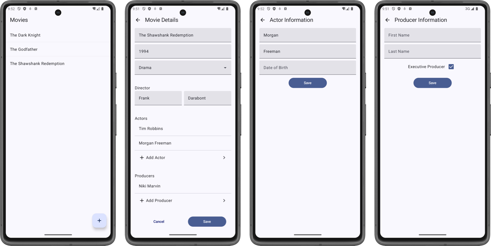

  

    
    
    

# Type Safe Navigation in Compose
Demonstrates how to navigate with Jetpack Compose while passing data between screens.
Demo App Preview:

	

## More information
This is a companion repository for the [Pass data between screens with Jetpack Compose Navigation + Hilt](https://blog.eclypse.io/pass-data-between-screens-with-jetpack-compose-navigation-hilt-947c72d7dc4e) article. Please refer to the blog for more information.

## Requirements

| Android Studio | Ladybug |
|:----------|:----------|
| Java | 8 |